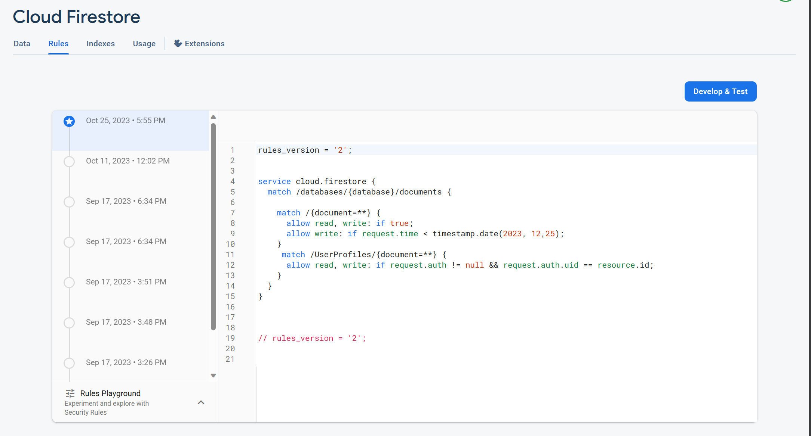
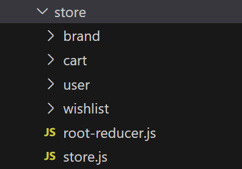
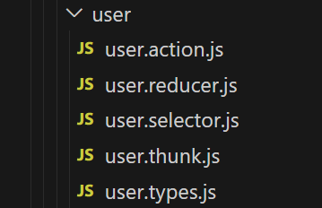

# Toy Cars Store Project - Frontend Repository

## Features

### Firestore Security Rules for Profile Authorization

- Using Firebase with Firestore Security Rules, the application ensures that only authenticated users with valid JWT tokens passing in as header would be able to retrieve and edit their own information.

- In the security rule below, only authorized users whose UID matches the document ID (with the collection design leveraging the user's UID as the document's ID) can access the data:

  

- Example usage:

  ```javascript
  const token = await user.getIdToken();
  let apiUrl = baseApiUrl + uid;
  const response = await fetch(apiUrl, {
    method: "GET",
    headers: {
      Authorization: `Bearer ${token}`,
    },
  });
  ```

### OAuth authentication with Firebase - [firebase.utils.js code](./src/utils/firebase/firebase.utils.js)

- Besides email and password login, users can seamlessly sign in with Google for an enhanced authentication experience.

  

### Redux Integration in React: Store, Actions, Selectors, and Thunk. - [Code for all slice reducers](https://github.com/lenguyenhcm325/frontend-toycars/tree/main/src/store)

- Using Redux with persist, thunk, and selectors simplifies state management and enhances data responsiveness in the React application.
<!--
   -->

- State management is _modularized_ into distinct files for actions, reducers, selectors, thunks, and types for each store.

  

- Redux thunk action example:

  ```javascript
  export const handleClearCartOnFS = (uid) => async (dispatch) => {
    try {
      dispatch(clearCartStart());
      await clearCartOnFS(uid);
      dispatch(clearCartSuccess());
    } catch (error) {
      dispatch(clearCartError(error));
    }
  };
  ```

- Leveraging `redux-persist` to reduce frequent data fetches, enhancing application performance.
  `redux-persist` setup:

  ```javascript
  const persistedReducer = persistReducer(persistConfig, rootReducer);
  export const store = configureStore({
    reducer: persistedReducer,
    middleware: (getDefaultMiddleware) =>
      getDefaultMiddleware({
        serializableCheck: {
          ignoredActions: [FLUSH, REHYDRATE, PAUSE, PERSIST, PURGE, REGISTER],
        },
      }),
  });
  ```

- Example action types

  ```javascript
  export const BRANDS_ACTION_TYPES = {
    FETCH_BRANDS_START: "brand/FETCH_BRANDS_START",
    FETCH_BRANDS_ERROR: "brand/FETCH_BRANDS_ERROR",
    FETCH_BRANDS_SUCCESS: "brand/FETCH_BRANDS_SUCCESS",
  };
  ```

- Selector to format cart items for backend-specific request schema

  ```javascript
  export const selectCheckoutItemsReqBody = (state) => {
    const cartItems = selectCartItems(state);
    let result = [];
    cartItems.forEach((productInfoWithQuantity) => {
      const flattenNameWithoutSpace = Object.keys(productInfoWithQuantity)[0];
      const productQuantity =
        productInfoWithQuantity[flattenNameWithoutSpace]["quantity"];
      result.push({
        [flattenNameWithoutSpace]: productQuantity,
      });
    });
    return result;
  };
  ```

### Comprehensive Implementation of Essential React Features

- This project showcases various React core features, including `useState` and `useEffect`.

- Every event listener is cleaned up when the component unmounts.

  ```javascript
  useEffect(() => {
    const handleBeforeUnload = () => {
      localStorage.removeItem("brands");
    };
    window.addEventListener("beforeunload", handleBeforeUnload);
    return () => {
      window.removeEventListener("beforeunload", handleBeforeUnload);
    };
  }, []);
  ```

### Validation mechanism for Cart Clearance on Payment Success

<!-- - After Stripe's redirection to `/payment-success` route, the frontend would send a request to the backend to see if the `session_id` query parameter is valid, if that's the case, the cart both from the Redux side and on Firestore will be flushed. This mechanism is to ensure that even when users accidentally go to the `payment-success` route (i.e. by typing in the url) would trigger accidentally a flush.  -->

- Upon Stripe's redirection to the `/payment-success` route, the frontend sends a request to the backend to validate the Stripe's `session_id` query parameter. If valid and the cart state hasn't been reset for this `session_id`, then the cart is cleared from both Redux and Firestore. This strategy ensures that unintended visits to the `payment-success` route won't inadvertently clear the cart.

- [Backend code for validation implementation](https://github.com/lenguyenhcm325/backend-toycars/blob/main/src/routers/payment.js#L43)

### Handling Invalid Routes: Displaying a 404 Not Found Page


